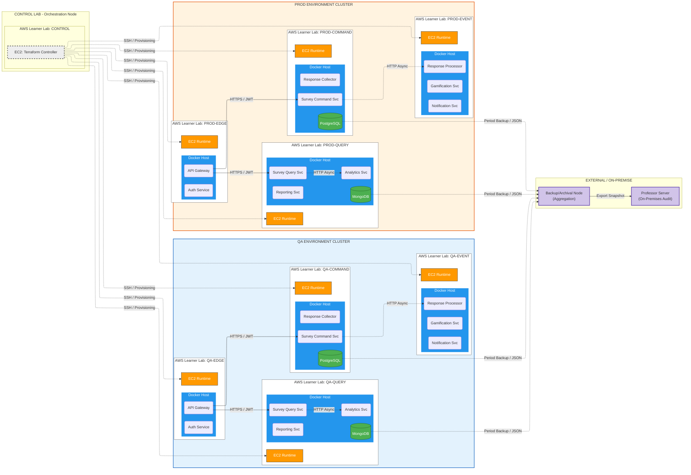

# Turborepo Monorepo for ASMAS (Distributed Survey Management System)

## Project Overview

This is a **Turborepo-based monorepo** that orchestrates a distributed microservices architecture for the ASMAS (Distributed Academic Survey Data Management System) project. The monorepo centralizes code organization, build orchestration, and shared dependencies across multiple Java microservices, shared libraries, infrastructure code, and documentation.

**Note:** This is an academic project designed to demonstrate distributed systems principles. Some CI/CD automation and production-level features are simplified due to academic scope and time constraints.

---

## Why TurboRepo?

TurboRepo was chosen for this project to address the following needs:

1. **Unified Build Orchestration:** Coordinate builds across 10+ microservices and shared packages without managing individual build scripts
2. **Dependency Management:** Clearly define relationships between services and shared libraries (e.g., `@repo/common-lib`)
3. **Task Caching:** Cache build outputs locally (and remotely via Vercel) to accelerate iterative development
4. **Incremental Builds:** Only rebuild services that have changed, reducing CI/CD pipeline duration
5. **Workspace Management:** npm workspaces simplify package version consistency across the monorepo
6. **Documentation Alignment:** Keep architecture docs (`docs/`) in sync with code changes through unified versioning

**Trade-off:** Monorepo complexity vs. simplified dependency management. For this academic project, the benefits of centralized orchestration outweigh the overhead.

---

## Repository Structure

### High-Level Layout

```
my-turborepo/                     # Monorepo root
├── apps/                         # Microservices & API Gateway
├── packages/                     # Shared libraries & configs
├── infra/                        # Infrastructure as Code (Terraform)
├── docs/                         # Architecture & design documentation
├── turbo.json                    # TurboRepo pipeline configuration
├── package.json                  # Root workspace dependencies
├── pnpm-workspace.yaml           # npm workspace definition (if using pnpm)
└── README.md                     # This file
```

---

## Folder Structure Explained

### 1. **apps/** – Microservices & API Gateway

Contains all deployable services. Each service is independently deployable and has its own Docker image.

```
apps/
├── api-gateway/                  # Spring Cloud Gateway
│   ├── src/main/java/           # Java source code
│   ├── pom.xml                  # Maven configuration
│   ├── Dockerfile               # Docker image definition
│   └── target/                  # Compiled JAR & artifacts
│
├── auth-service/                # Authentication & JWT validation
│   ├── src/main/java/
│   ├── pom.xml
│   ├── Dockerfile
│   └── target/
│
├── survey-command/              # CQRS Command side (writes)
│   ├── src/main/java/
│   ├── pom.xml
│   ├── Dockerfile
│   └── target/
│
├── survey-query/                # CQRS Query side (reads)
│   ├── src/main/java/
│   ├── pom.xml
│   ├── Dockerfile
│   └── target/
│
├── response-collector/          # Collect survey responses
├── event-processor/             # Event-driven business logic
├── notifications/               # Send notifications to users
├── gamification/                # Reward & gamification logic
├── analytics/                   # Data aggregation & analytics
├── reporting/                   # Report generation
│
└── [Additional services as needed]
```

**Key Points:**
- Each service uses **Maven** (`pom.xml`) for Java dependency management
- Each service has a **Dockerfile** for containerization
- Services are independently deployable to AWS EC2 instances
- Communication: REST (synchronous) or Kafka (asynchronous)

### 2. **packages/** – Shared Libraries & Configurations

Reusable code and configurations used across multiple services and applications.

```
packages/
├── common-lib/                  # Shared Java utilities & constants
│   ├── src/main/java/          # Domain models, exceptions, utils
│   ├── pom.xml                 # Published as Maven package
│   └── [Used by: survey-*, response-*, event-*]
│
├── eslint-config/              # ESLint rules (TypeScript/JavaScript)
│   ├── base.js                 # Base linting rules
│   ├── next.js                 # Next.js-specific rules
│   ├── react-internal.js       # React component rules
│   └── package.json
│
├── typescript-config/          # TypeScript compilation configs
│   ├── base.json               # Base TypeScript config
│   ├── nextjs.json             # Next.js projects
│   ├── react-library.json      # React libraries
│   └── package.json
│
└── ui/                         # Shared React UI components (if applicable)
    ├── src/components/         # Reusable UI components
    ├── package.json
    ├── tsconfig.json
    └── eslint.config.mjs
```

**Key Points:**
- `common-lib/` reduces code duplication across microservices
- Config packages (`eslint-config`, `typescript-config`) enforce consistency
- All packages are npm workspaces; versions managed centrally

### 3. **infra/terraform/** – Infrastructure as Code

Terraform modules and configurations for AWS provisioning. Managed separately from application code but versioned together.

```
infra/terraform/
├── base/                       # Shared VPC, subnets, security
│   ├── vpc.tf                 # Virtual Private Cloud setup
│   ├── subnets.tf             # Public & private subnets
│   ├── security.tf            # Security group rules
│   ├── igw.tf                 # Internet Gateway
│   ├── nat.tf                 # NAT Gateway (for private subnet egress)
│   └── variables.tf           # Input variables
│
├── modules/                    # Reusable Terraform modules
│   ├── bootstrap/             # Bootstrap resources (S3, IAM)
│   ├── ec2-node/              # EC2 instance template
│   ├── security/              # Security group definitions
│   └── [Additional modules]
│
├── environments/               # Environment-specific configs
│   ├── prod/                  # Production environment
│   │   ├── analytics/         # Analytics service deployment
│   │   ├── api-gateway/       # API Gateway deployment
│   │   ├── auth-service/      # Auth service deployment
│   │   └── [Additional services]
│   │
│   └── qa/                    # QA environment (mirrors prod structure)
│       ├── analytics/
│       ├── api-gateway/
│       └── [Additional services]
│
├── control/                    # State management & backend config
│   ├── main.tf               # Terraform backend configuration
│   ├── terraform.tfvars      # Backend-specific variables
│   └── terraform.tfstate     # Remote state (managed externally)
│
├── alb.tf                     # Application Load Balancer config
├── autoscaling.tf            # Auto Scaling Group definitions
├── bastion.tf                # Bastion host setup
├── launch_templates.tf       # EC2 launch template definitions
├── listeners.tf              # ALB listener rules
├── target_groups.tf          # ALB target group configurations
├── variables.tf              # Global variables
└── .terraform.lock.hcl       # Terraform provider lock file
```

**Key Points:**
- Infrastructure is **code-managed** via Terraform for reproducibility
- `environments/prod/` and `environments/qa/` are logically isolated
- Each environment can have independent configurations (instance sizes, replicas, etc.)
- `control/` manages Terraform state backend (S3 or Terraform Cloud)

### 4. **docs/** – Architecture & Design Documentation

Human-readable documentation for architectural decisions and design patterns.

```
docs/
├── api-gateway.md              # API Gateway routing & configuration
├── jwt-integration.md          # JWT validation flow & claims
├── gateway-claims.md           # JWT claims structure
├── survey-command-infrastructure.md  # Command service architecture
├── [Additional docs]
└── [Diagrams & architecture notes]
```

**Key Points:**
- Documentation lives alongside code and is version-controlled
- Explains design decisions and architectural patterns used in services
- Referenced during code reviews and professor evaluation

---

## Microservices Organization (apps/)

### Service Categorization

Services are logically organized by functional domain:

#### **Edge Layer** (Client-facing)
- **api-gateway:** Single entry point; routes requests, validates JWT, applies rate limiting
- **auth-service:** Issues JWT tokens; manages authentication

#### **Command Side** (CQRS - Write Model)
- **survey-command:** Create, update, delete surveys
- **response-collector:** Accept and store survey responses

#### **Query Side** (CQRS - Read Model)
- **survey-query:** Query surveys and respondents
- **analytics:** Aggregate analytics data
- **reporting:** Generate reports

#### **Event Processing** (Async Consumers)
- **event-processor:** Consumes events from Kafka; applies business logic
- **notifications:** Sends notifications based on events
- **gamification:** Tracks user engagement and rewards

#### **Infrastructure & Support**
- **[Additional services as required by project scope]**

### Service Dependencies

```
Client Requests
    ↓
api-gateway (validates JWT, routes)
    ↓
    ├→ auth-service (authentication)
    ├→ survey-command (write)
    ├→ survey-query (read)
    └→ response-collector (responses)
    
    ↓ (publishes events)
    
Event Bus (Kafka)
    ↓
    ├→ event-processor
    ├→ notifications
    ├→ analytics
    └→ gamification

    ↓ (writes to)
    
Databases
    ├→ PostgreSQL (Command DB)
    ├→ MongoDB (Query DB / Reporting)
    └→ Redis (Cache)
```

---

## How TurboRepo Orchestrates the Project

### 1. **Task Execution** (`turbo.json`)

TurboRepo defines a **task pipeline** that orchestrates builds across all services:

```json
{
  "tasks": {
    "build": {
      "outputs": ["target/**", "dist/**"],
      "cache": true,
      "dependsOn": ["^build"]
    },
    "test": {
      "outputs": ["coverage/**"],
      "cache": true,
      "dependsOn": ["build"]
    },
    "lint": {
      "cache": true
    },
    "dev": {
      "cache": false
    }
  }
}
```

**Example Execution:**
```bash
turbo build
# Builds all services in dependency order:
# 1. Builds packages/ (common-lib, configs)
# 2. Builds apps/ (api-gateway, auth-service, etc.)
# 3. Caches outputs for future runs
```

### 2. **Dependency Graph Management**

TurboRepo automatically detects dependencies between workspaces:
- `survey-command` depends on `common-lib` → TurboRepo ensures `common-lib` builds first
- Changes to `common-lib` invalidate cache for all dependent services
- Incremental builds only recompile affected services

### 3. **Parallel Execution**

TurboRepo runs independent tasks in parallel (when possible):
```bash
turbo build
# Runs in parallel:
# - api-gateway & auth-service (no dependencies between them)
# - survey-command & response-collector (independent)
# - Etc.
```

### 4. **Filtering & Scoped Builds**

Developers can build specific services for faster iteration:
```bash
turbo build --filter=api-gateway
turbo build --filter="apps/*"
turbo dev --filter=survey-command
```

### 5. **Remote Caching (Optional)**

For CI/CD pipelines, TurboRepo can cache build outputs in Vercel or similar service, enabling faster builds across machines and team members.

---

## Development Workflow

### Local Development

1. **Setup**
   ```bash
   cd my-turborepo
   npm install  # or pnpm install
   ```

2. **Build All Services**
   ```bash
   turbo build
   # Compiles all Java services (Maven) and TypeScript configs
   ```

3. **Develop a Specific Service**
   ```bash
   turbo dev --filter=survey-command
   # Runs the service in development mode (auto-reload)
   # Access at localhost:8080 (or configured port)
   ```

4. **Run Tests**
   ```bash
   turbo test --filter=api-gateway
   # Runs unit tests for api-gateway via Maven
   ```

5. **Lint & Format**
   ```bash
   turbo lint
   # Checks all TypeScript and Java code
   ```

### Build Pipeline for Deployment

1. **Local Commit** (with Conventional Commits)
   ```bash
   git commit -m "feat(survey-command): add survey validation"
   ```

2. **Push to `qa` Branch**
   ```bash
   git push origin qa
   ```

3. **GitHub Actions CI/CD** (automatic)
   - Runs `turbo build` and `turbo test`
   - If successful: builds Docker images and pushes to registry
   - If successful: merges to `qa` branch and deploys to QA environment

4. **Promote to `prod` Branch** (manual approval)
   ```bash
   git push origin prod  # Requires PR review
   ```

5. **Deployment to AWS**
   - EC2 instances pull latest Docker images
   - Services restart with new code
   - ALB health checks validate service availability

---

## Academic Scope & Design Decisions

### Why This Monorepo Structure?

1. **Unified Versioning:** All services versioned together; no dependency mismatch issues
2. **Shared Code:** `common-lib` reduces duplication across 10+ services
3. **Coordinated Releases:** Ensures QA and PROD environments run compatible versions
4. **Documentation Alignment:** Docs versioned with code; no outdated documentation

### Simplifications Due to Academic Constraints

1. **No Production CI/CD:** Full automation not implemented; manual deployments acceptable for evaluation
2. **Minimal Observability:** Prometheus/Grafana setup is basic; advanced tracing not implemented
3. **Single AWS Account:** All environments (QA/PROD) in same AWS Academy account
4. **Simplified Security:** JWT validation basic; no OAuth 2.0 or advanced rate limiting
5. **Local Testing:** Services tested locally with Docker Compose; not on AWS during development

### Trade-Offs Made

| Decision | Reasoning |
|----------|-----------|
| Monorepo vs. Multi-repo | Simplified dependency management; better for academic evaluation |
| TurboRepo vs. Lerna/Rush | Lighter weight; excellent caching; good documentation |
| Maven + npm | Java services need Maven; configs/docs use npm workspaces |
| Single VPC | Cost optimization for AWS Academy free tier |
| Bastion Host | Security without added complexity; one SSH entry point |
| Async via Kafka | Decouples services; enables independent scaling |

---

## Using this example

Run the following command:

```sh
npx create-turbo@latest
```

## What's inside?

This Turborepo includes the following packages/apps:

### Apps and Packages

- `docs`: a [Next.js](https://nextjs.org/) app
- `web`: another [Next.js](https://nextjs.org/) app
- `@repo/ui`: a stub React component library shared by both `web` and `docs` applications
- `@repo/eslint-config`: `eslint` configurations (includes `eslint-config-next` and `eslint-config-prettier`)
- `@repo/typescript-config`: `tsconfig.json`s used throughout the monorepo

Each package/app is 100% [TypeScript](https://www.typescriptlang.org/).

### Utilities

This Turborepo has some additional tools already setup for you:

- [TypeScript](https://www.typescriptlang.org/) for static type checking
- [ESLint](https://eslint.org/) for code linting
- [Prettier](https://prettier.io) for code formatting

### Build

To build all apps and packages, run the following command:

```
cd my-turborepo

# With [global `turbo`](https://turborepo.com/docs/getting-started/installation#global-installation) installed (recommended)
turbo build

# Without [global `turbo`](https://turborepo.com/docs/getting-started/installation#global-installation), use your package manager
npx turbo build
yarn dlx turbo build
pnpm exec turbo build
```

You can build a specific package by using a [filter](https://turborepo.com/docs/crafting-your-repository/running-tasks#using-filters):

```
# With [global `turbo`](https://turborepo.com/docs/getting-started/installation#global-installation) installed (recommended)
turbo build --filter=docs

# Without [global `turbo`](https://turborepo.com/docs/getting-started/installation#global-installation), use your package manager
npx turbo build --filter=docs
yarn exec turbo build --filter=docs
pnpm exec turbo build --filter=docs
```

### Develop

To develop all apps and packages, run the following command:

```
cd my-turborepo

# With [global `turbo`](https://turborepo.com/docs/getting-started/installation#global-installation) installed (recommended)
turbo dev

# Without [global `turbo`](https://turborepo.com/docs/getting-started/installation#global-installation), use your package manager
npx turbo dev
yarn exec turbo dev
pnpm exec turbo dev
```

You can develop a specific package by using a [filter](https://turborepo.com/docs/crafting-your-repository/running-tasks#using-filters):

```
# With [global `turbo`](https://turborepo.com/docs/getting-started/installation#global-installation) installed (recommended)
turbo dev --filter=web

# Without [global `turbo`](https://turborepo.com/docs/getting-started/installation#google-installation), use your package manager
npx turbo dev --filter=web
yarn exec turbo dev --filter=web
pnpm exec turbo dev --filter=web
```

---

## Deployment Model (Multi-Learner Lab - AWS Academy)

The following diagram illustrates the distributed deployment model used in the ASMAS project.
Each AWS Academy Learner Lab represents an independent node and failure domain.



---

## Remote Caching

> [!TIP]
> Vercel Remote Cache is free for all plans. Get started today at [vercel.com](https://vercel.com/signup?/signup?utm_source=remote-cache-sdk&utm_campaign=free_remote_cache).

Turborepo can use a technique known as [Remote Caching](https://turborepo.com/docs/core-concepts/remote-caching) to share cache artifacts across machines, enabling you to share build caches with your team and CI/CD pipelines.

By default, Turborepo will cache locally. To enable Remote Caching you will need an account with Vercel. If you don't have an account you can [create one](https://vercel.com/signup?utm_source=turborepo-examples), then enter the following commands:

```
cd my-turborepo

# With [global `turbo`](https://turborepo.com/docs/getting-started/installation#global-installation) installed (recommended)
turbo login

# Without [global `turbo`](https://turborepo.com/docs/getting-started/installation#global-installation), use your package manager
npx turbo login
yarn exec turbo login
pnpm exec turbo login
```

This will authenticate the Turborepo CLI with your [Vercel account](https://vercel.com/docs/concepts/personal-accounts/overview).

Next, you can link your Turborepo to your Remote Cache by running the following command from the root of your Turborepo:

```
# With [global `turbo`](https://turborepo.com/docs/getting-started/installation#global-installation) installed (recommended)
turbo link

# Without [global `turbo`](https://turborepo.com/docs/getting-started/installation#global-installation), use your package manager
npx turbo link
yarn exec turbo link
pnpm exec turbo link
```

## Useful Links

Learn more about the power of Turborepo:

- [Tasks](https://turborepo.com/docs/crafting-your-repository/running-tasks)
- [Caching](https://turborepo.com/docs/crafting-your-repository/caching)
- [Remote Caching](https://turborepo.com/docs/core-concepts/remote-caching)
- [Filtering](https://turborepo.com/docs/crafting-your-repository/running-tasks#using-filters)
- [Configuration Options](https://turborepo.com/docs/reference/configuration)
- [CLI Usage](https://turborepo.com/docs/reference/command-line-reference)
